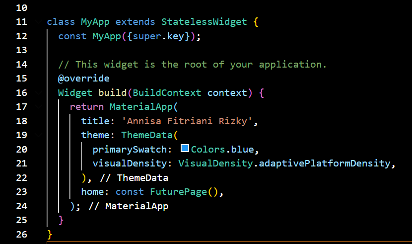
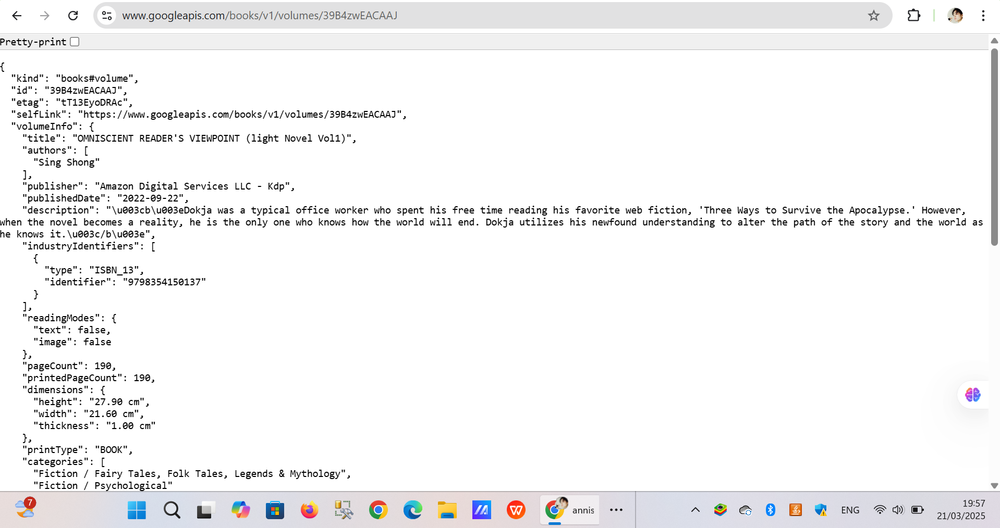
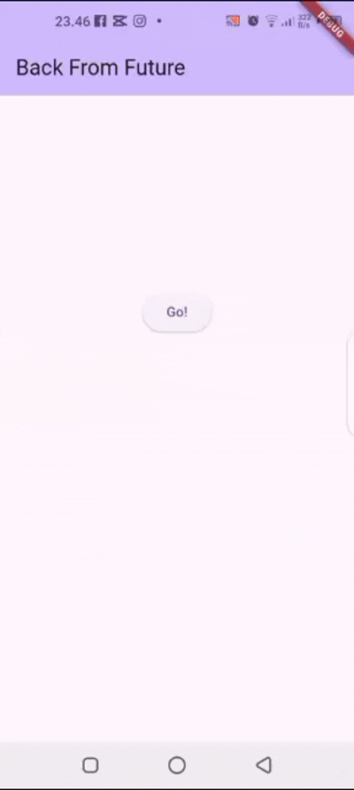
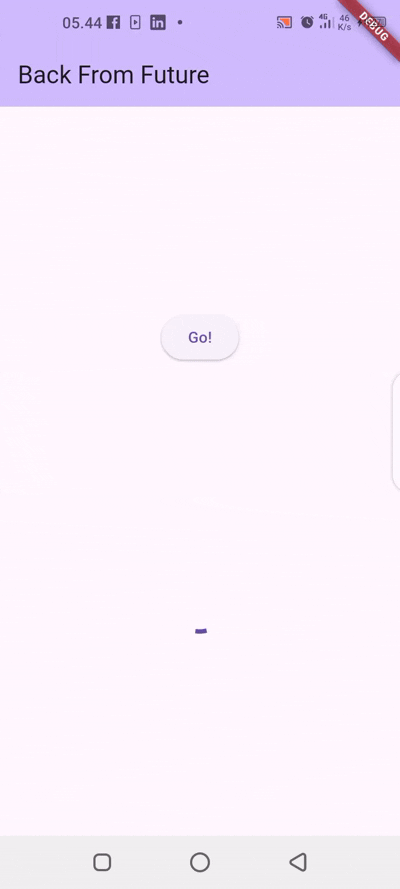
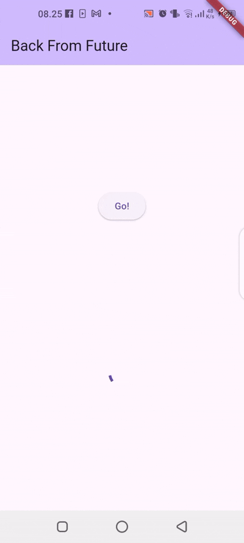
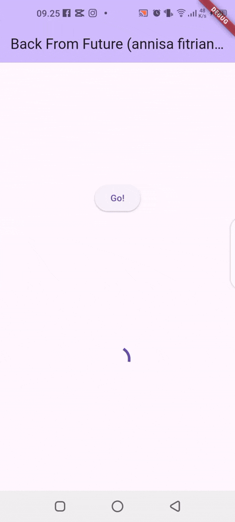
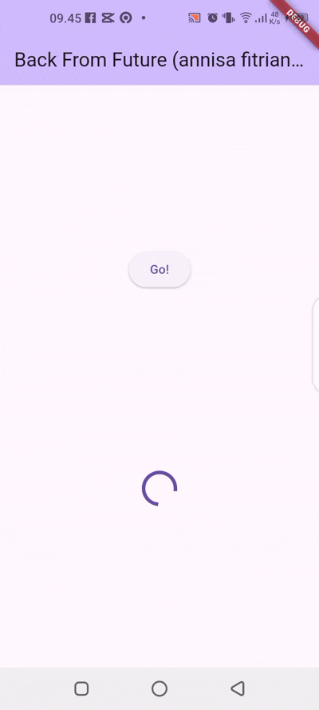

Nama		: Annisa Fitriani Rizky
Kelas		: TI SE 22 P
NIM		    : 1122140008
Judul Tugas	: Pemrograman asynchronous di Flutter

TUGAS PRAKTIKUM 1
Soal 1

-> Tambahkan nama panggilan Anda pada title app sebagai identitas hasil pekerjaan Anda.

Soal 2

-> Carilah judul buku favorit Anda di Google Books, lalu ganti ID buku pada variabel path di kode tersebut. Caranya ambil di URL browser Anda seperti gambar berikut ini.

-> Kemudian cobalah akses di browser URI tersebut dengan lengkap seperti ini. Jika menampilkan data JSON, maka Anda telah berhasil. Lakukan capture milik Anda dan tulis di README pada laporan praktikum. Lalu lakukan commit dengan pesan "W5: Soal 2".

Soal 3

-> Jelaskan maksud kode langkah 5 tersebut terkait substring dan catchError!

Jawaban :

Dalam contoh kode di langkah 5 bagian value.body.toString().substring(0, 450); terdapat substring(0, 450) yang memastikan bahwa hanya bagian awal string (hingga 450 karakter) yang diambil. Ini berguna jika respons API terlalu panjang dan hanya sebagian kecil yang diperlukan.
Sementara catchError menangkap kesalahan jika terjadi kegagalan saat memanggil getData(). Jika terjadi error (misalnya jaringan terputus atau server tidak merespons), kode ini akan mengatur nilai result menjadi 'An error occurred'.

-> Capture hasil praktikum Anda berupa GIF dan lampirkan di README. Lalu lakukan commit dengan pesan "W5: Soal 3".

Tugas Praktikum 2

Soal 4

-> Jelaskan maksud kode langkah 1 dan 2 tersebut!

Jawaban :

-> Capture hasil praktikum Anda berupa GIF dan lampirkan di README. Lalu lakukan commit dengan pesan "W5: Soal 4".

Tugas Praktikum 3

Soal 5

-> Jelaskan maksud kode langkah 2 tersebut!

->Capture hasil praktikum Anda berupa GIF dan lampirkan di README. Lalu lakukan commit dengan pesan "W5: Soal 5"

Soal 6

-> Jelaskan maksud perbedaan kode langkah 2 dengan langkah 5-6 tersebut!

-> Capture hasil praktikum Anda berupa GIF dan lampirkan di README. Lalu lakukan commit dengan pesan "W5: Soal 6".

Tugas Praktikum 4

Soal 7

-> Capture hasil praktikum Anda berupa GIF dan lampirkan di README. Lalu lakukan commit dengan pesan "W5: Soal 7".

Soal 8

-> Jelaskan maksud perbedaan kode langkah 1 dan 4!

Jawaban :

Perbedaannya ada di cara mereka mengelola beberapa Future yang berjalan bersamaan. 
Kalau pakai FutureGroup, kita harus menambahkan Future satu per satu, lalu menutup grupnya (close()) supaya bisa mengambil hasilnya. Ini berguna kalau jumlah Future tidak pasti atau ditentukan di runtime.

Sementara kalau pakai Future.wait(), kita langsung menuliskan semua Future dalam satu list, dan Dart otomatis menunggu semuanya selesai. Cara ini lebih sederhana, efisien, dan lebih umum digunakan.
Jadi, kalau jumlah Future sudah jelas sejak awal, lebih baik pakai Future.wait(). Kalau jumlahnya bisa berubah-ubah, baru FutureGroup bisa jadi pilihan.

Tugas Praktikum 5

Soal 9

-> Capture hasil praktikum Anda berupa GIF dan lampirkan di README. Lalu lakukan commit dengan pesan "W5: Soal 9"

Soal 10

-> Panggil method handleError() tersebut di ElevatedButton, lalu run. Apa hasilnya? Jelaskan perbedaan kode langkah 1 dan 4!

returnError() adalah fungsi yang hanya menghasilkan error setelah delay 2 detik tanpa menangani kesalahannya sendiri. Kalau dipanggil langsung, error tersebut harus ditangani oleh pemanggilnya, misalnya dengan .catchError() atau try-catch, kalau tidak, program bisa crash. Sementara itu, handleError() memanggil returnError() tetapi sudah menangani errornya langsung menggunakan try-catch. Jadi, jika returnError() melempar exception, handleError() akan menangkapnya dan memperbarui state aplikasi dengan menampilkan pesan error di UI, bukan membiarkan aplikasi berhenti. Selain itu, ada blok finally yang memastikan bahwa "Complete" tetap dicetak ke debug console, baik terjadi error maupun tidak.

Tugas Praktikum 6

Soal 11

-> Tambahkan nama panggilan Anda pada tiap properti title sebagai identitas pekerjaan Anda.

