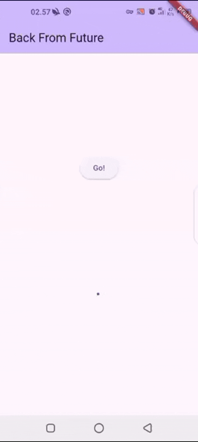
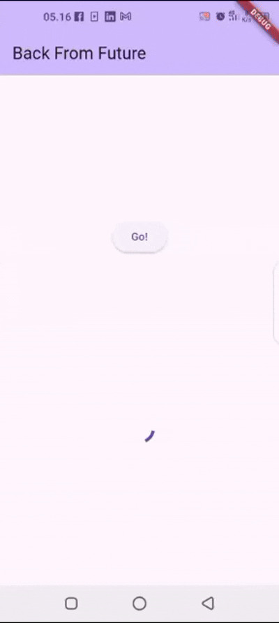

Nama		: Annisa Fitriani Rizky
Kelas		: TI SE 22 P
NIM		    : 1122140008
Judul Tugas	: Pemrograman asynchronous di Flutter

TUGAS PRAKTIKUM 1
Soal 1

-> Tambahkan nama panggilan Anda pada title app sebagai identitas hasil pekerjaan Anda.

Soal 2

-> Carilah judul buku favorit Anda di Google Books, lalu ganti ID buku pada variabel path di kode tersebut. Caranya ambil di URL browser Anda seperti gambar berikut ini.

-> Kemudian cobalah akses di browser URI tersebut dengan lengkap seperti ini. Jika menampilkan data JSON, maka Anda telah berhasil. Lakukan capture milik Anda dan tulis di README pada laporan praktikum. Lalu lakukan commit dengan pesan "W5: Soal 2".

Soal 3

-> Jelaskan maksud kode langkah 5 tersebut terkait substring dan catchError!

Jawaban :

Dalam contoh kode di langkah 5 bagian value.body.toString().substring(0, 450); terdapat substring(0, 450) yang memastikan bahwa hanya bagian awal string (hingga 450 karakter) yang diambil. Ini berguna jika respons API terlalu panjang dan hanya sebagian kecil yang diperlukan.
Sementara catchError menangkap kesalahan jika terjadi kegagalan saat memanggil getData(). Jika terjadi error (misalnya jaringan terputus atau server tidak merespons), kode ini akan mengatur nilai result menjadi 'An error occurred'.

-> Capture hasil praktikum Anda berupa GIF dan lampirkan di README. Lalu lakukan commit dengan pesan "W5: Soal 3".

Tugas Praktikum 2

Soal 4

-> Jelaskan maksud kode langkah 1 dan 2 tersebut!

Jawaban :

Langkah 1 : menyediakan fungsi-fungsi async dengan delay yang mengembalikan angka.

Langkah 2 : menjalankan fungsi-fungsi itu satu per satu, menjumlahkan hasilnya, dan menampilkannya di UI. Ini melatih konsep dasar pengelolaan async dengan await dan update state dengan setState().

-> Capture hasil praktikum Anda berupa GIF dan lampirkan di README. Lalu lakukan commit dengan pesan "W5: Soal 4".

Tugas Praktikum 3

Soal 5

-> Jelaskan maksud kode langkah 2 tersebut!

Jawaban :

Kode ini mensimulasikan proses asynchronous manual menggunakan Completer. Fungsi getNumber() segera mengembalikan Future, tapi nilainya baru tersedia setelah calculate() menyelesaikannya 5 detik kemudian dengan completer.complete(42).

->Capture hasil praktikum Anda berupa GIF dan lampirkan di README. Lalu lakukan commit dengan pesan "W5: Soal 5"

Soal 6

-> Jelaskan maksud perbedaan kode langkah 2 dengan langkah 5-6 tersebut!

Jawaban :

pada langkah 2 tidak menangani error, jadi kalau misalnya terjadi error di delayed (meskipun kecil kemungkinannya), error akan menggagalkan Future dan tidak ada fallback atau info error yang diberikan ke pemanggil.

sementara pada langkah 5-6 menggunakan try-catch untuk menangkap error yang mungkin terjadi. Sehingga, jika terjadi error di dalam blok try, misalnya kita mengaktifkan throw Exception();, maka: completer.completeError({}) akan dipanggil. Ini membuat completer.future menyelesaikan dengan error, bukan nilai.

-> Capture hasil praktikum Anda berupa GIF dan lampirkan di README. Lalu lakukan commit dengan pesan "W5: Soal 6".

Tugas Praktikum 4

Soal 7

-> Capture hasil praktikum Anda berupa GIF dan lampirkan di README. Lalu lakukan commit dengan pesan "W5: Soal 7".

Soal 8

-> Jelaskan maksud perbedaan kode langkah 1 dan 4!

Jawaban :

Perbedaannya ada di cara mereka mengelola beberapa Future yang berjalan bersamaan. 
Kalau pakai FutureGroup, kita harus menambahkan Future satu per satu, lalu menutup grupnya (close()) supaya bisa mengambil hasilnya. Ini berguna kalau jumlah Future tidak pasti atau ditentukan di runtime.

Sementara kalau pakai Future.wait(), kita langsung menuliskan semua Future dalam satu list, dan Dart otomatis menunggu semuanya selesai. Cara ini lebih sederhana, efisien, dan lebih umum digunakan.
Jadi, kalau jumlah Future sudah jelas sejak awal, lebih baik pakai Future.wait(). Kalau jumlahnya bisa berubah-ubah, baru FutureGroup bisa jadi pilihan.

Tugas Praktikum 5

Soal 9

-> Capture hasil praktikum Anda berupa GIF dan lampirkan di README. Lalu lakukan commit dengan pesan "W5: Soal 9"

Soal 10

-> Panggil method handleError() tersebut di ElevatedButton, lalu run. Apa hasilnya? Jelaskan perbedaan kode langkah 1 dan 4!

returnError() adalah fungsi yang hanya menghasilkan error setelah delay 2 detik tanpa menangani kesalahannya sendiri. Kalau dipanggil langsung, error tersebut harus ditangani oleh pemanggilnya, misalnya dengan .catchError() atau try-catch, kalau tidak, program bisa crash. Sementara itu, handleError() memanggil returnError() tetapi sudah menangani errornya langsung menggunakan try-catch. Jadi, jika returnError() melempar exception, handleError() akan menangkapnya dan memperbarui state aplikasi dengan menampilkan pesan error di UI, bukan membiarkan aplikasi berhenti. Selain itu, ada blok finally yang memastikan bahwa "Complete" tetap dicetak ke debug console, baik terjadi error maupun tidak.

Tugas Praktikum 6

Soal 11

-> Tambahkan nama panggilan Anda pada tiap properti title sebagai identitas pekerjaan Anda.

Soal 12

-> Jika Anda tidak melihat animasi loading tampil, kemungkinan itu berjalan sangat cepat. Tambahkan delay pada method getPosition() dengan kode await Future.delayed(const Duration(seconds: 3));

-> Apakah Anda mendapatkan koordinat GPS ketika run di browser? Mengapa demikian?

Jawaban :

Ya, saya mendapatkan koordinat GPS saat menjalankan di browser (Chrome), karena plugin geolocator secara otomatis menggunakan geolocator_web untuk platform web, yang mengakses lokasi lewat API navigator.geolocation milik browser. Selain itu, browser seperti Chrome memperbolehkan akses lokasi saat dijalankan dari localhost dan telah diberikan izin oleh pengguna. Namun, data lokasi yang didapat biasanya berdasarkan Wi-Fi atau IP, bukan dari GPS perangkat secara langsung, sehingga akurasinya bisa lebih rendah dibanding perangkat mobile.

-> Capture hasil praktikum Anda berupa GIF dan lampirkan di README. Lalu lakukan commit dengan pesan "W5: Soal 12".

Soal 13

-> Apakah ada perbedaan UI dengan praktikum sebelumnya? Mengapa demikian?

Jawaban :

Secara tampilan UI, hasil dari praktikum 6 dan 7 terlihat mirip, yaitu menampilkan animasi loading terlebih dahulu, lalu menampilkan lokasi pengguna setelah didapatkan. Namun, ada perbedaan cara kerja di balik UI antara keduanya, yaitu pada praktikum sebelumnya (Prak 6), data lokasi diambil secara manual di initState() lalu UI diperbarui menggunakan setState().

Sedangkan di praktikum ini (Prak 7), digunakan widget FutureBuilder yang lebih efisien, clean, dan reactive karena langsung menghubungkan Future dengan UI tanpa harus mengelola state secara manual.

Penggunaan FutureBuilder juga memudahkan untuk menangani berbagai kondisi Future seperti loading, success, dan error, sehingga kode lebih mudah dibaca dan dikelola.

-> Capture hasil praktikum Anda berupa GIF dan lampirkan di README. Lalu lakukan commit dengan pesan "W5: Soal 13".

-> Seperti yang Anda lihat, menggunakan FutureBuilder lebih efisien, clean, dan reactive dengan Future bersama UI.

Soal 14 :

-> Apakah ada perbedaan UI dengan langkah sebelumnya? Mengapa demikian?

Jawaban :

Ya, ada perbedaan pada UI setelah menambahkan handling error menggunakan snapshot.hasError. Sekarang, jika terjadi error saat mengambil data lokasi (misalnya user menolak izin lokasi atau device tidak bisa mengakses lokasi), maka UI akan menampilkan pesan:
"Something terrible happened!"
Sebelumnya, jika terjadi error, UI hanya diam atau menampilkan data kosong karena tidak ada penanganan error secara eksplisit.

Dengan menambahkan pengecekan snapshot.hasError, aplikasi menjadi lebih user-friendly karena pengguna mendapatkan feedback saat terjadi error.

-> Capture hasil praktikum Anda berupa GIF dan lampirkan di README. Lalu lakukan commit dengan pesan "W5: Soal 14".

(ini apabila user menyetujui mengaktifkan lokasi gps)

(ini yang terjadi apabila user menolak mengaktifkan lokasi gps)